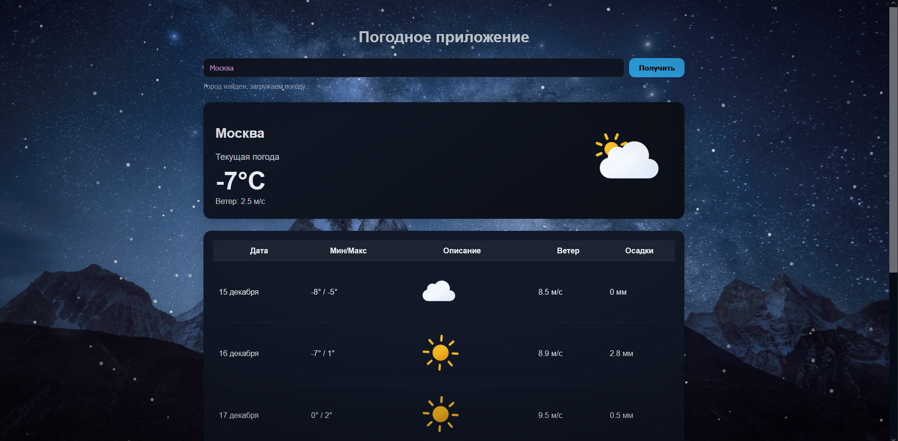

# ❄️ Погодное приложение с анимацией снега

Красивое погодное веб‑приложение, которое показывает текущую погоду и прогноз на 7 дней, автоматически определяет город пользователя и добавляет анимированный снег на фоне.





---

## 🚀 Функциональность

### 🔍 Поиск города
- Подсказки по городам при вводе (Open‑Meteo Geocoding API)
- Подстановка координат выбранного города
- Загрузка погоды по клику на подсказку или кнопку **«Получить»**

### 📍 Автоопределение локации
- Использование `navigator.geolocation`
- Автоматическая загрузка погоды для текущих координат
- Текстовый статус: поиск города, успех, ошибка

### 🌤 Текущая погода
- Название города
- Описание (текущая погода)
- Температура
- Скорость ветра
- Иконка погодного состояния

### 📅 Прогноз на 7 дней
- Дата
- Минимальная / максимальная температура
- Иконка погоды
- Максимальная скорость ветра
- Количество осадков

### ❄️ Анимация снега (Canvas)
- Рисование снежинок через `CanvasRenderingContext2D`
- Разный размер, скорость, прозрачность и дрейф снежинок
- Плавное покачивание с помощью `Math.sin`
- Адаптация под размер окна (обработка события `resize`)

### 🏔 Фоновое изображение
- Статичное изображение гор на фоне
- Звёздное небо
- Лёгкое затемнение краёв (`body::after`) для фокуса на контенте

---

## 🛠 Стек технологий

- **HTML5**
- **CSS3**
- **JavaScript**
- **Canvas 2D API**
- **Open‑Meteo API**
  - Geocoding API
  - Forecast API

---
```
/
├── index.html        # Разметка приложения
├── style.css         # Стили, фон, карточки, таблицы, снег
├── script.js         # Подсказки, автолокация, погода, Canvas-анимация
├── README.md         # Документация
│
└── img/
    ├── icons/        # SVG-иконки погоды
       ├── clear.svg
       ├── cloudy.svg
       ├── rain.svg
       ├── snow.svg
       ├── thunder.svg
       └── drizzle.svg
```
